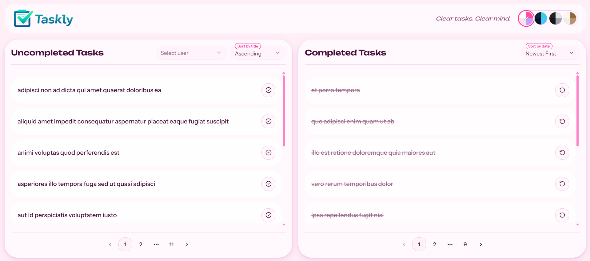
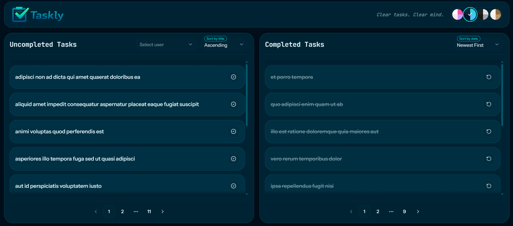
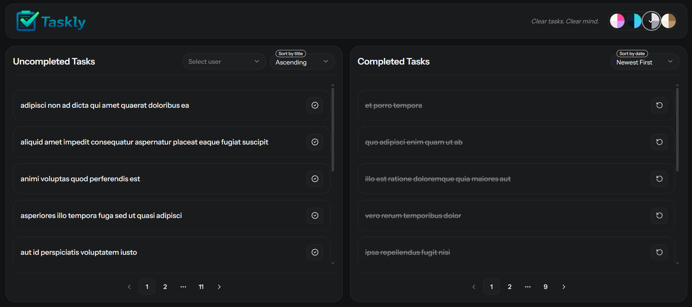
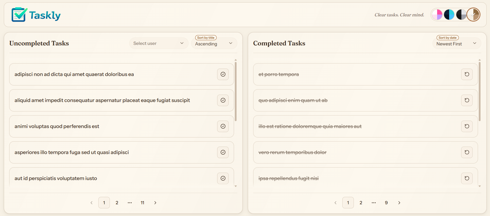

# Taskly

A sleek, multi-theme to-do app built with **React Router 7**, **React 19**, and **Tailwind CSS v4**. Taskly lets you fetch tasks from a public API, mark them as complete or incomplete, filter by user, sort, and paginate — all inside a polished, accessible UI with four fully-realized visual themes.

---

## Screenshots

> **Pink Paradise theme**



> **Deep Ocean theme** (default)



> **Modern Dark theme**



> **Warm Beige theme**



---

## Features

- ✅ **Two-column task board** — Uncompleted tasks on the left, completed on the right
- 🎉 **Confetti animation** — Fires on task completion with palette matched to the active theme
- 🔍 **Filter by user** — Floating-label combobox filters both columns simultaneously
- ↕️ **Sort controls** — Sort uncompleted tasks by title (A–Z / Z–A); completed by newest or oldest first
- 📄 **Pagination** — Configurable page size (5 / 10 / 20 / 50 per page) with smart ellipsis pagination
- 🎨 **Four premium themes** — Each with unique typography, radius, surface treatment, focus states, and ambient decor:
  | Theme | Personality | Type |
  |---|---|---|
  | **Pink Paradise** | Pink gloss, Unbounded display, shimmer | Light |
  | **Deep Ocean** | Navy/cyan, immersive underwater glass | Dark |
  | **Modern Dark** | Graphite, flat/crisp, restrained SaaS | Dark |
  | **Warm Beige** | Off-white, Fraunces serif, editorial | Light |
- 🔄 **Persistent theme** — Saved to `localStorage`, restored on reload with no flash
- ♿ **Accessible** — ARIA labels, keyboard-navigable theme switcher (radiogroup + arrow keys), `prefers-reduced-motion` support, WCAG AA color contrast

---

## Prerequisites

| Requirement | Version                          |
| ----------- | -------------------------------- |
| **Node.js** | `>= 20.x` (LTS recommended)      |
| **npm**     | `>= 10.x` (bundled with Node 20) |
| **Git**     | Any recent version               |

> The app uses native ES Modules (`"type": "module"` in `package.json`) and Vite 8. Node 20+ is required.

To check your installed versions:

```bash
node --version   # should print v20.x.x or higher
npm --version    # should print 10.x.x or higher
```

---

## Installation

1. **Clone the repository**

   ```bash
   git clone https://github.com/evlinchi/dss-final-project.git
   cd dss-final-project
   ```

2. **Install dependencies**

   ```bash
   npm install
   ```

   This installs all runtime and dev dependencies, including:
   - `react` + `react-dom` (v19)
   - `react-router` (v7)
   - `tailwindcss` (v4) + `@tailwindcss/vite`
   - `@base-ui/react` + `radix-ui` — accessible headless components
   - `lucide-react` — icon library
   - `canvas-confetti` — task completion animation
   - Per-theme self-hosted webfonts (`@fontsource-variable/*`)

---

## Running Locally

Start the development server with Hot Module Replacement (HMR):

```bash
npm run dev
```

The app will be available at **[http://localhost:5173](http://localhost:5173)**.

> The dev server proxies task and user data from the public [JSONPlaceholder API](https://jsonplaceholder.typicode.com). An active internet connection is required to load tasks on first render.

---

## Available Scripts

| Script              | Description                                                       |
| ------------------- | ----------------------------------------------------------------- |
| `npm run dev`       | Start the Vite dev server with HMR on port 5173                   |
| `npm run build`     | Type-check and compile a production bundle into `./build/`        |
| `npm run start`     | Serve the production build locally (`./build/server/index.js`)    |
| `npm run typecheck` | Run `react-router typegen` then `tsc` — no output means no errors |

---

## Project Structure

```
app/
├── app.css                          # Shared base tokens, @theme inline mappings, imports all theme files
├── root.tsx                         # App shell — ThemeProvider, Header, ThemeDecor, Outlet
│
├── styles/
│   ├── themes/
│   │   ├── frutiger-aero.css        # Aqua/cyan — frosted glass, Space Grotesk
│   │   ├── y2k.css                  # Pink/silver — glossy, Unbounded
│   │   ├── oceanic.css              # Navy/cyan dark — underwater glass
│   │   ├── modern-dark.css          # Graphite dark — flat, crisp
│   │   └── beige.css                # Warm off-white — paper grain, Fraunces serif
│   └── theme-utilities.css          # .glass, .glossy, .paper, .glow-ring, .alert-destructive
│
├── lib/
│   ├── theme-provider.tsx           # 5-theme enum + localStorage persistence
│   ├── theme-meta.ts                # Per-theme metadata (label, swatches, confetti palette, isDark)
│   ├── use-theme.ts                 # useTheme() hook
│   └── use-theme-effect.ts          # Writes data-theme attr + dark class to <html>
│
├── components/
│   ├── layout/
│   │   ├── header.tsx               # Logo, tagline, ThemeSwitcher
│   │   └── theme-decor.tsx          # Fixed decorative background layer per theme
│   └── ui/
│       ├── button.tsx               # CVA button — radius token, gradient variant
│       ├── combobox.tsx             # Base UI combobox — floating label on value
│       ├── input.tsx                # Semantic-token input
│       ├── pagination.tsx           # Pagination controls
│       └── theme-switcher.tsx       # Conic-gradient swatch radiogroup
│
├── routes/
│   └── index/
│       ├── index.tsx                # Main route — fetches tasks, handles complete/uncomplete
│       ├── helpers/
│       │   └── filtered-data-provider.tsx  # Context for filter/sort/pagination state
│       └── partials/
│           ├── task-card.tsx        # Individual task row with confetti + semantic tokens
│           ├── task-panel-card.tsx  # Panel wrapper with skeleton, empty state, error state
│           ├── uncompleted-tasks.tsx
│           └── completed-tasks.tsx
│
├── interfaces/
│   ├── task.interface.ts
│   └── user.interface.ts
│
└── services/
    ├── tasks.service.ts             # Fetches from JSONPlaceholder /todos
    └── users.service.ts             # Fetches from JSONPlaceholder /users
```

---

## Theme System

Themes are switched via a **`data-theme` attribute** on `<html>`. Each theme is a self-contained CSS file under `app/styles/themes/` that overrides a shared token vocabulary (OKLCh color space):

```css
/* example token set inside oceanic.css */
[data-theme="oceanic"] {
  --background: oklch(0.11 0.03 230);
  --primary: oklch(0.78 0.18 195);
  --font-display: "Instrument Sans Variable", sans-serif;
  --radius: 0.75rem;
  /* ... */
}
```

Utility classes like `.glass`, `.glossy`, and `.paper` in `theme-utilities.css` adapt their appearance per theme — no component ever branches on the theme name.

The active theme is persisted to `localStorage` under the key `"theme"` and restored with zero flash on page reload (the default theme's variables are also declared on `:root` so they apply before React hydrates).

---

## Building for Production

```bash
npm run build
```

Outputs to:

```
build/
├── client/    # Static assets (JS, CSS, fonts)
└── server/    # SSR server entry
```

Serve the production build:

```bash
npm run start
```

The server listens on port `3000` by default. Set `PORT=<number>` to override.

---

## Data Source

Tasks and users are fetched from the free, public **[JSONPlaceholder](https://jsonplaceholder.typicode.com)** REST API:

- `GET https://jsonplaceholder.typicode.com/todos?completed=false` — uncompleted tasks
- `GET https://jsonplaceholder.typicode.com/todos?completed=true` — completed tasks
- `GET https://jsonplaceholder.typicode.com/users` — user list for the filter

No API key or authentication is required. All task mutations (complete / uncomplete) are **local only** — they are not persisted to any server.

---

## Browser Support

| Browser                | Supported            |
| ---------------------- | -------------------- |
| Chrome / Edge 114+     | ✅ Full support      |
| Firefox 117+           | ✅ Full support      |
| Safari 17+             | ✅ Full support      |
| Mobile Chrome / Safari | ✅ Responsive layout |

> `backdrop-filter` (used by `.glass`) is supported in all modern browsers. Browsers without support fall back to a solid tinted panel automatically via `@supports`.

---

## Accessibility

- Keyboard-only navigation: Tab through header → theme switcher → filters → tasks → pagination
- Theme switcher uses ARIA `radiogroup` semantics with arrow-key navigation
- Every interactive element has a visible focus ring styled to match the active theme
- Color is never the sole indicator of state — completion is signalled by icon change + strikethrough text + color
- All animations respect `prefers-reduced-motion: reduce`
